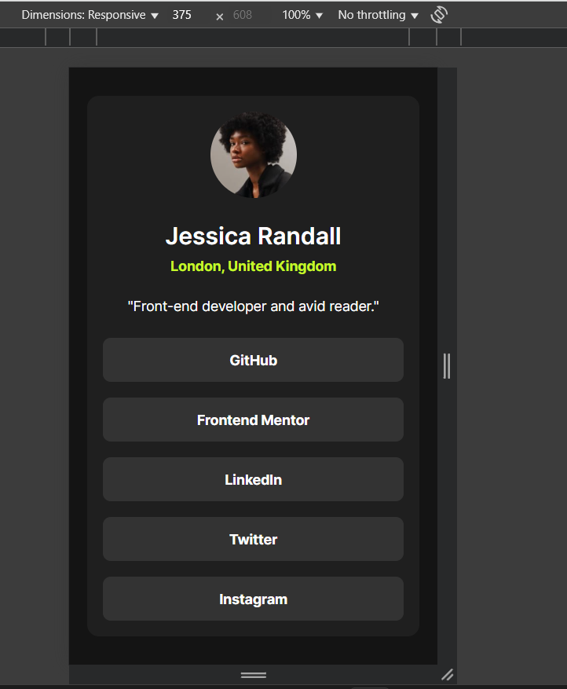
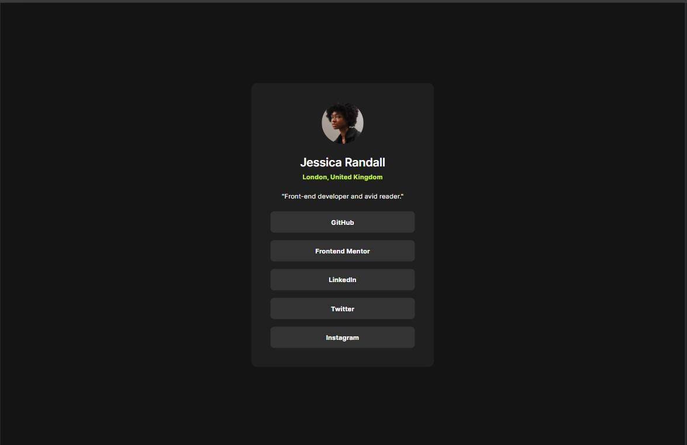

# Frontend Mentor - Social links profile

## Welcome! 👋

Thanks for checking out this front-end coding challenge.

This is a solution to the [Social links profile challenge on Frontend Mentor](https://www.frontendmentor.io/challenges/social-links-profile-UG32l9m6dQ). Frontend Mentor challenges help me improve my coding skills by building realistic projects. 

## Table of contents

- [Overview](#overview)
  - [The challenge](#the-challenge)
  - [Screenshot](#screenshot)
  - [Links](#links)
- [My process](#my-process)
  - [Built with](#built-with)
  - [What I learned](#what-i-learned)
  - [Continued development](#continued-development)
  - [Useful resources](#useful-resources)
- [Author](#author)
- [Acknowledgments](#acknowledgments)

## Overview

### The challenge

Users should be able to:

- See hover and focus states for all interactive elements on the page

### Screenshot

### Links

- Solution URL: [Social Media's Github Page](https://github.com/irsalinalayalia/fe_mentor_social_links_profile)
- Live Site URL: [Social Media's Live Site](https://irsalinalayalia.github.io/fe_mentor_social_links_profile/)

## My process

### Built with

- Semantic HTML5 markup
- CSS custom properties
- Flexbox
- Mobile-first workflow

### What I learned

Through building this project, I strengthened my understanding of modern HTML and CSS techniques. Specifically, I learned:

- How to structure a clean and semantic HTML layout using elements like 
, <ul>, <li>, and .
- How to manage custom fonts using @font-face in CSS and apply them consistently across elements.
- How to use CSS variables (:root) to create a centralized and maintainable color and typography system.
- How to implement responsive design using clamp() for padding and width to adapt to various screen sizes.
- How to style interactive elements such as social media buttons with :hover effects to enhance user experience.
- The importance of Flexbox for building centered and responsive layouts.
- How to improve accessibility and user experience through consistent font sizing, contrast, and spacing.

This project helped me get more comfortable with layout styling, reusable design tokens (variables), and interactive hover states for better visual feedback.

### Useful resources

- [Jasoneczek's Profile on Front End Mentor](https://www.frontendmentor.io/profile/jasoneczek) - This profile helped me out to know the exact size of the card and padding because my FE Mentor Member is not premium so I dont get the figma file and dont know the exact size and the Jasoneczek's profile helps me alot.

## Author

- Website - [Irsalina Layalia Shabrina](https://irsalinalayalia.vercel.app/)

- Frontend Mentor - [@irsalinalayalia](https://www.frontendmentor.io/profile/irsalinalayalia)

## Acknowledgments

Thanks to God who always help and accompanied me when working on this project
